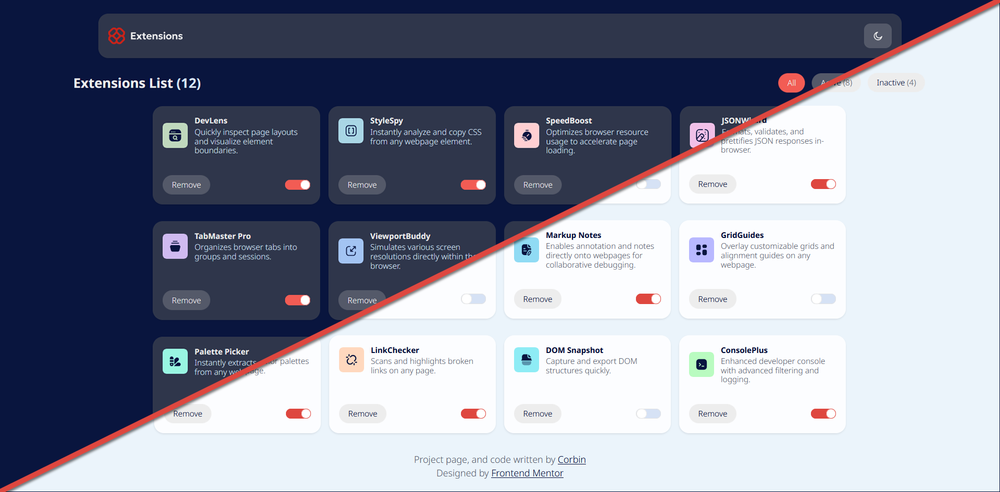

# Browser Extensions Manager UI

## Description
This is my version of Frontend Mentor's browser extensions manager UI challenge. This is a simple UI that allows you to enable, disable, and remove browser extensions. It's fully responsive and uses a JSON file to load the extensions. I've also added my own QOL features like a warning dialog when removing extensions and a count of active and inactive extensions.

## Features Included From Original
- Dark Mode / Light Mode
- Tabs
- Panels
- Removing Extensions
- Toggle to enable/disable extensions
- Loading available extensions from a JSON file

## Features Added
- Warning Dialoge when removing extensions
- Count of active, inactive, and total extensions

## Attributions
Webpage designed by [Frontend Mentor](https://www.frontendmentor.io/)

### Technologies Used
- [HTML](https://www.w3schools.com/html/)
- [CSS](https://www.w3schools.com/css/)
- [JavaScript](https://www.w3schools.com/js/)

### Tools Used During Development
- [VS Code](https://code.visualstudio.com/)
- [Live Server](https://marketplace.visualstudio.com/items?itemName=ritwickdey.LiveServer)
- [Git](https://git-scm.com/)
- [ProtoIO On/Off Flip Switch Generator](https://proto.io/freebies/onoff/)
- [Supermaven Copilot](https://supermaven.com/)

